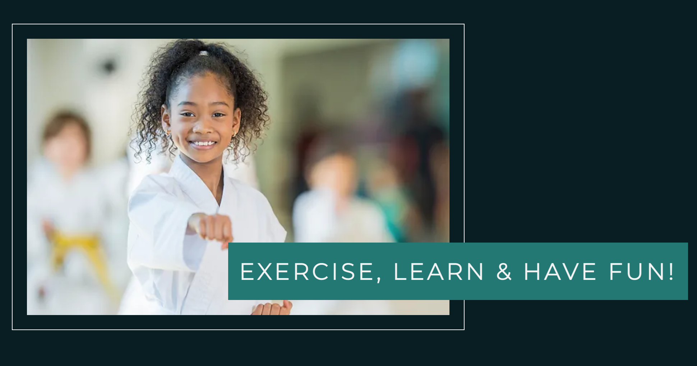

# Karate Koi

## 1. Purpose of the project

Karate Koi is a site for the karate club based in Stockholm, Sweden. The site is targeted towards those who want to start training karate in the club. Whether it is a beginner or someone with prior training, child or adult. The website is also targeted to those are just intrested in learning a bit about the sport. Katare Koi is useful for those who are intrested in learning about or joining the sport. As well as for those who have joined to see the scheduled training sessions.

 

[LIVE SITE HERE](https://oogieorange.github.io/project-1-karate-koi/)

 

---

## 2. User stories

 

Why does the user want to visit the site and what do they expect from it?

 

- The user wants to be able to get information about the club.
- The user wants to see if karate is something for me and get a basic understanding of the sport.
- The user wants to see where the club is located, how the dojo looks and how to contact them.
- The user wants to see when the training is.
- The user wants to sign up for training with the club.

 

- The user wants to instantly know what the website is for.
- The user wants the website to be easily navigated and look pleasing regardless of screen size.
- The user wants the links to work as expected and intended.

---

## 3. Features

 

### Exsisting Features

 

Header

- The header is featured on all pages on the website, and linked to the Logo, Home page, About page, Schedule page and Sign Up page through a nav bar. It is identical across all pages to ensure a easy and comfortable navigation.

- This feature will allow the user easy access to all the pages on the website, across all devices. And ensure that they won't have to use the "back" button for a navigational purposes.

 

 

Landing page image

- The landing page provides a photograph and text overlay.

- The image introduces the main focus of Karate Koi while the cover text explains in precice words why you should try karate, and may act as an intrigue to read more.

 

 

Why karate section

- This section will present the benefits of doing karate, as well as the benefits and reasonswhy you should join the Karate Koi club.

- The feature will spark intruige in the sport, and motivate the user towards choosing to start using karate as their form of exercise. As well as welcome them to sign up and join training with the club.

 

 

Open house section

- The open house section will present general information about, times and address for the clubs open house.

- The map will introduce the dojo address while inviting the user to look up its location. While the ideé of an open house will motivate the user to visit before joining, to see if it's for them.

 

 

Footer

- The footer will include social links in the form of icons, that will open in a seperate tab. As well as contact information in the form of an email address and a phone number. And will be identical and precent. on all pages on the website for easy access.

- The footer, with the information and links provided, will encourage the user to keep being connected with the club. Whether it be. through social media or a question sent to the club.

 

 

About page image

- The about page provides a photograph and cover text.

- This feature works much like the landing page image, as the picture draws focus while the cover text introduces what the page is concerned with. While

 

 

Karate section

- The karate section introduces information about the sport to the user.

- The section provides the user with a bit of a deeper understanding of the sport and training itself. This will answer the user if karate might besomething for them.

 

 

Karate video

- The karate video section will provide a video introducing what makes karate karate.

- The video feature will introduce more information about the sport to the user, much like the previous feature. The intention with this is to make sure the user gets a fundimental understanding of what karate is before starting to train with the club. This will ensure that they do not join. the club to quit after a while as it was not what they expected.

 

 

About us section

- The section is to introduce information about the club itself.

- The feature intends to give the user an understanding on how the club functions and how they train together.

 

 

Schedule page

- The schedule page features a photograph of the dojo and a schedule for training times. And is followed by a repeat of the open house section.

- The schedule page photograph introduces the dojoas the place the information is regarding. While the schedule feature is for both new and old users to keep up with the training times of the club. The repeat open house section is intended to further welcome and remind users to visit the dojo.

 

 

Sign up

- This page will include a short text and a sign up form.

- The feature is intended to prepare the user for starting routines and welcome them through the text. While the form will allow. the user to sign up for training with the club. The user will be asked to provide their full name and email address. As well as what level they are on and if they are singning up for themselves or a child.

 

 

Welcome

- This page will show when the user sent in the form. And display a welcome message with some instructions.

- The feature is intended to confirm to the user that the form has been sent. And give them further instructions on how to proceed.

 

 

### Future Features

 

Gallery

- The gallery will provide the user with a group of supporting images to how the training looks.

- The gallery will be a valuable feature for the user as it will will provide them with an image of how the training is and what the training environment looks like.

---

## 5. Typography and color scheme

 

- The Karate Koi website will feature a color scheme consisting of black pearl, elm and white smoke. For a clean, calm and simple look.

- The selected typografy consists of Montserrat and Quicksand, with a backup of Sans-seif. The focus is a clean design and a clear readability.

---

## 6. Wireframes

[View wireframe for desktop and mobile sceen size](/wireframe.md)

---

## 7. Technology

 

- HTML5
- CSS3
- Google Fonts,   Was used to import the 'Montserrat' and 'Quicksand' font familys into the connected css stylesheet.
- Font Awesome,   Was used to import icons representing socials to the footer.
- Pexels,   Was used to source images for the project.
- Am I Responsive,   Was used for checking responsiveness.
- Git,   Was used to commit and push my code to GitHub.
- GitHub,   Was used to facilitate my project and to deploy it.
- W3C Validator and W3C jigsaw CSS validator,   Was used to validate the code.

---

## 8. Testing

 

The site have been tested and supported on following browsers,

 

On desktop,

- Safari
- Chrome 
- Mozilla Firefox
- Microsoft Edge

---

## 9. Code validation

 

Code validation is confimed through W3C Validator and W3C jigsaw CSS validator.

 

W3C Validator results,

 

 

W3C jigsaw CSS Validator results,

 

---

## 10. Fixed bugs

 

- The 'Sing up' and 'Welcome' pages didn't want to center on screens with 510px width or smaller. I fixed this by adjusting padding value in a media querie. 

---

## 11. Deployment

 

The deployment was made through GitHub pages and the process was as followes,

 

- Open GitHub repository and open the settings tab
- From settings navigate to pages tab
- Under branch, select the main branch through the dropdown menu
- Once selected and saved, the page will be refreshed (in case of nothing happening wait for a couple muinites and refresh page manually)
- The refreshed page will show a detailed ribbon containing the website link and indicate a successful deployment.

 

[LIVE SITE HERE](https://oogieorange.github.io/project-1-karate-koi/)

 

---

## 12. Credits

 

- [W3 Schools](https://www.w3schools.com/) For answering any query I had along the way
- The 'Love Running' project that helped me with footer and some compositional ideés
- [ActiveCambrige](https://www.youtube.com/@ActiveCambridge) For their video '5 Things You Need to Know About Karate'